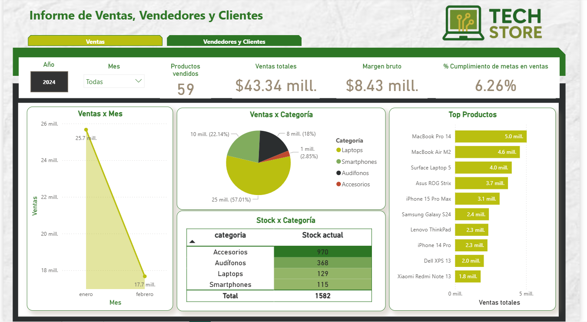
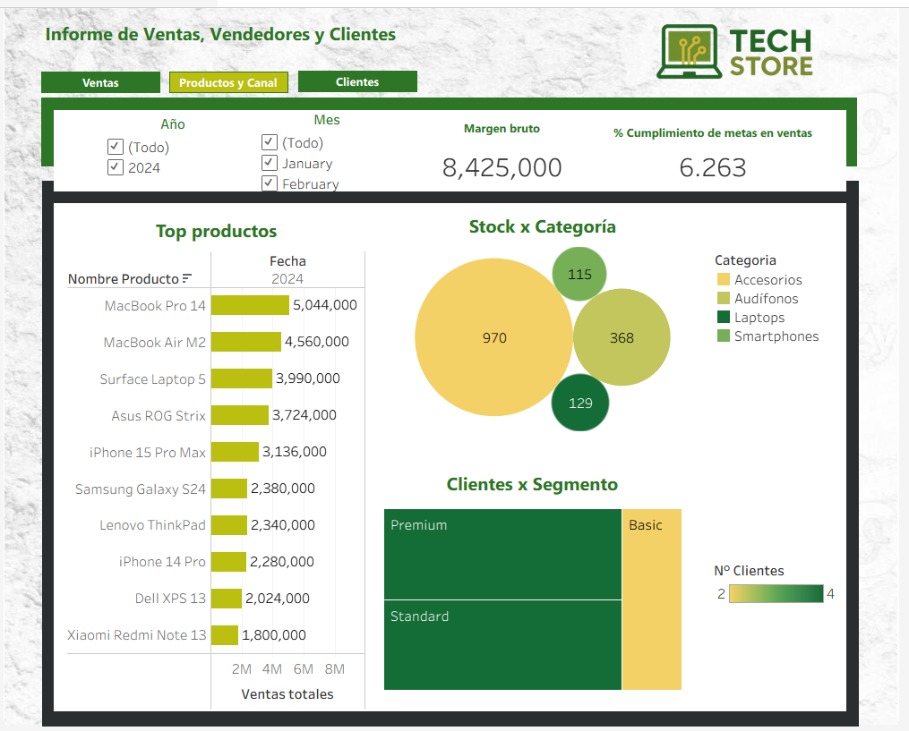

# Análisis comparación Power BI y Tableau

## 1. Proceso de construcción del dashboard

### En Power BI

- Se cargaron las tablas del dataset TechStore desde los archivos csv
- Power BI detectó automáticamente las relaciones entre tablas (cliente_id, producto_id).
- Se crearon medidas DAX para:

  - Ventas Totales
  - % Cumplimiento de metas en ventas
  - Margen neto
  - % Cumplimiento de metas en nuevos clientes
  - Promedio de nuevos clientes por año

- Visualizaciones

  - Gráfico de líneas: Ventas por mes con filtro de fecha dinámico.
  - Barras: Top 10 productos por ventas (se aplica filtro para que sólo aparezcan 10).
  - Circular: Ventas por categoría de producto.
  - Tabla: Stock por categoría
  - Tabla: Performance de vendedores con ventas.
  - Circular: Clientes por segmento
  - Barras: Ventas por canal.
  - Mapa: clientes por ciudad.

- Se agregó en ambas hojas un filtro tanto de mes cómo de año.
- Se añadieron actions entre hojas: botones para poder cambiar entre hojas.

### En Tableau

- Se cargaron las tablas y se crearon uniones lógicas (Relationships).
- Se definieron Calculated Fields para:

  - Ventas Totales
  - % Cumplimiento de metas en ventas
  - Promedio de nuevos clientes por año
  - Margen neto

- Se definió un parámetro para cambiar el performance de los vendedor con base en el canal de ventas

- Visualizaciones
  - Las misma que en powerBi pero cambia la forma de visualización del stock por categoría (a burbujas) y clientes por segmento (a diagrama de árbol).
- Se añadió filtro para año y para mes.
- Se agregó botones para poder cambiar entre hojas.

## 2. Comparación de aspectos clave

| Aspecto                | **Power BI**                                                                                                                                                                                                                                                                                                                                                                                                                                       | **Tableau**                                                                                                                                                                                                                                                                                                                                                                                                                                                                                                                                              |
| ---------------------- | -------------------------------------------------------------------------------------------------------------------------------------------------------------------------------------------------------------------------------------------------------------------------------------------------------------------------------------------------------------------------------------------------------------------------------------------------- | -------------------------------------------------------------------------------------------------------------------------------------------------------------------------------------------------------------------------------------------------------------------------------------------------------------------------------------------------------------------------------------------------------------------------------------------------------------------------------------------------------------------------------------------------------- |
| Modelado de datos      | Detección automática de relaciones muy intuitiva. la opción para limpiar los datos en caso de errores es muy conveniente e intuitiva, gracias a eso también se pueden visualizar los datos completamente.                                                                                                                                                                                                                                          | Se necesitan conectar las diferentes tablas y cargar los datos no es tan intuitivo, me llevó cierto tiempo descubrirlo.                                                                                                                                                                                                                                                                                                                                                                                                                                  |
| Medidas y cálculos     | DAX es poderoso pero complejo, requiere fórmulas más técnicas, hay que investigar un poco sobre la forma de utilizar estas funciones.                                                                                                                                                                                                                                                                                                              | Calculated Fields más sencillos y parecidos a Excel. También a la hora de utilizarlos en los gráficos fue muy sencillo porque daba flexibilidad.                                                                                                                                                                                                                                                                                                                                                                                                         |
| Interactividad         | Los filtros son fáciles de configurar. Al seleccionar un elemento en un gráfico, se actualizan las demás visualizaciones del dashboard. Para personalizaciones más avanzadas a veces es necesario crear medidas adicionales, aunque el aspecto visual es bastante configurable.                                                                                                                                                                    | Los filtros también son fáciles de configurar. La selección en un gráfico se refleja automáticamente en todo el dashboard. Utilizar los filtros y los botones para cambio de hoja es mucho más intuitivo.                                                                                                                                                                                                                                                                                                                                                |
| Personalización visual | Se puede controlar completamente el aspecto visual, permite poner fondo al lienzo, crear formas con fines decorativos y se ve elegante. Incluye líneas guía de alineación, lo cual facilita mucho las cosas a la hora de insertar los gráficos. También tiene la ventaja de que permite agregar sobras y bordes a los gráficos, lo cual hace que el aspecto mejore y no se encontró esa opción en Tableau. Es mucho más intuitivo en este aspecto. | Tiene paleta de colores, lo cual puede facilitar las cosas si no se tiene un diseño en mente, pero en este caso dónde ya se tenían los colores específicos a usar fue difícil personalizarlos y obligando a elegir la paleta de colores que más se asemejaba. Destaca que optimiza la visualización en diferentes dispositivos, aunque esto implica ajustar manualmente el diseño o crear múltiples tableros según el tamaño de pantalla. No permite insertar formas nativas, por lo que, por ejemplo, un rectángulo de color debe cargarse como imagen. |
| Costo de uso           | Gratuito, solo se requiere licencia de pago si se publican dashboards en la nube.                                                                                                                                                                                                                                                                                                                                                                  | Requiere licencia de pago, por lo que fue necesario adquirir la versión de prueba por 14 días.                                                                                                                                                                                                                                                                                                                                                                                                                                                           |

## 3. Limitaciones

- **Power BI**: Lo más difícil fue la necesidad de aprender DAX para cálculos personalizados, ya que la curva de aprendizaje es más técnica. Hubiera sido más sencillo si ofreciera fórmulas más cercanas a Excel.

  El aprendizaje es más rápido porque la interfaz es más intuitiva y se entiende rápido cómo armar las visualizaciones.

- **Tableau**: el mayor reto fue conectar las tablas y personalizar la apariencia, ya que la interfaz para los colores y formas es más limitada. Me hubiera gustado que ofreciera opciones de personalización más directas y flexibles.

  Fue necesario más tiempo de configuración porque requirió más pasos para unir tablas y personalizar gráficos, aunque la interacción fue más fluida una vez configurado.

## Recomendación final

✅ Si el objetivo es construir dashboards rápidos, con bonita apariencia y sin costo, Power BI es la mejor opción.

✅ Si se requiere mayor flexibilidad en la exploración y en la interacción visual de los datos, sobre todo para análisis más profundos, Tableau ofrece ventajas claras.
